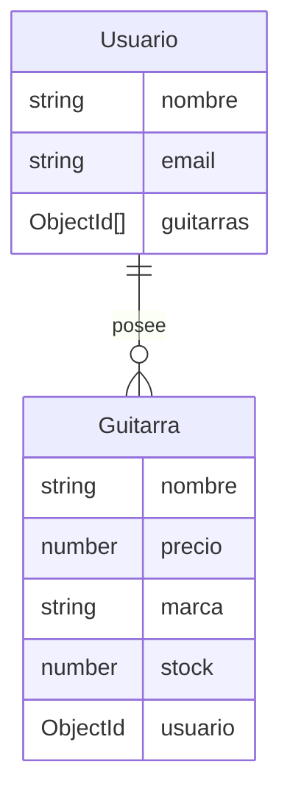

# Proyecto API de Guitarras y Usuarios

Esta API permite gestionar una base de datos de **Usuarios** y **Guitarras**, con una relación uno a muchos. Cada usuario puede tener múltiples guitarras, y cada guitarra pertenece a un único usuario.

## Descripción del Proyecto

Esta API está construida con **Node.js** y **Express**, y utiliza **MongoDB** con **Mongoose** para la gestión de la base de datos. El objetivo es proporcionar una API RESTful que permita crear, leer, actualizar y eliminar (CRUD) tanto usuarios como guitarras, manteniendo una relación de propiedad entre ellos.

## Prerrequisitos o Dependencias

Para ejecutar este proyecto, asegúrate de tener instalado lo siguiente:

- **Node.js** (versión 14 o superior)
- **MongoDB** (preferiblemente MongoDB Atlas para conexión remota)
- **NPM** (versión 6 o superior)

## Instalación del Proyecto

Sigue estos pasos para configurar y ejecutar el proyecto:

```bash
# Clonar el repositorio
git clone https://github.com/brayandiazc/nodeApi_musicStore.git

# Navegar al directorio del proyecto
cd nodeApi_musicStore

# Instalar dependencias
npm install
```

## Configuración del Entorno

Crea un archivo `.env` en la raíz del proyecto con el siguiente contenido, ajustando la URI de MongoDB con tus credenciales:

```bash
PORT=3000
MONGODB_URI=mongodb+srv://<usuario>:<contraseña>@cluster0.mongodb.net/musica?retryWrites=true&w=majority
```

## Instrucciones para Ejecutar el Proyecto

Para ejecutar el servidor en modo de desarrollo, utiliza el siguiente comando:

```bash
npm run dev
```

## Estructura del Proyecto

Este proyecto sigue una estructura basada en el patrón **MVC** (Model-View-Controller) para mejorar la organización y escalabilidad.

```
my-project/
├── controllers/          # Controladores de lógica de negocio
│   ├── guitarraController.js
│   └── usuarioController.js
├── models/               # Modelos Mongoose
│   ├── Guitarra.js
│   └── Usuario.js
├── routes/               # Rutas del servidor
│   ├── guitarra.js
│   └── usuario.js
├── config/               # Configuración de conexión a MongoDB
│   └── db.js
├── .env                  # Variables de entorno
├── index.js              # Punto de entrada del servidor
└── package.json          # Dependencias y scripts del proyecto
```

## Diagrama de Base de Datos

El siguiente diagrama en **Mermaid** representa la estructura de la base de datos con la relación uno a muchos entre **Usuarios** y **Guitarras**:



## Instrucciones para Cargar la Base de Datos o Migrar los Modelos

Este proyecto no requiere migraciones adicionales ya que utiliza **Mongoose**, que automáticamente crea los esquemas en MongoDB. Asegúrate de que la conexión esté configurada correctamente en el archivo `.env`.

## Comandos para Cargar los Datos Semilla a la Base de Datos

Para crear un usuario y asociarle guitarras de ejemplo, puedes hacer una solicitud `POST` a las siguientes rutas:

1. **Crear Usuario** (`POST /api/usuarios`):

   ```json
   {
     "nombre": "Juan Perez",
     "email": "juan@example.com"
   }
   ```

2. **Crear Guitarra Asociada** (`POST /api/guitarras`):
   ```json
   {
     "nombre": "Gibson Les Paul",
     "precio": 1500,
     "marca": "Gibson",
     "stock": 3,
     "usuario": "<ID del usuario>"
   }
   ```

## Autor

- [Brayan Diaz C](https://github.com/brayandiazc)

## Licencia

Este proyecto está bajo la Licencia MIT - consulta el archivo [LICENSE.md](LICENSE) para más detalles.

---

⌨️ con ❤️ por [Brayan Diaz C](https://github.com/brayandiazc) 😊
